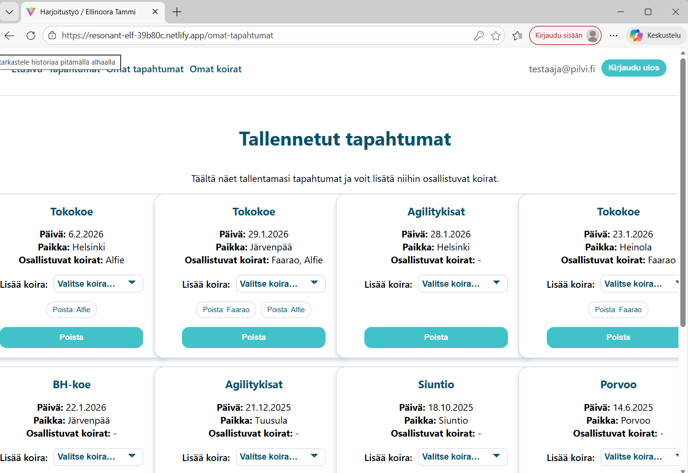
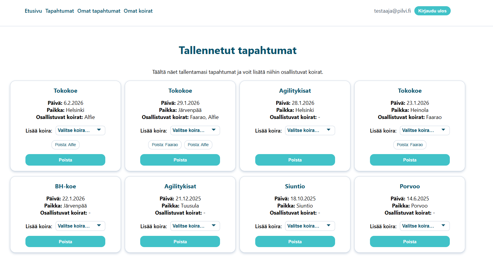
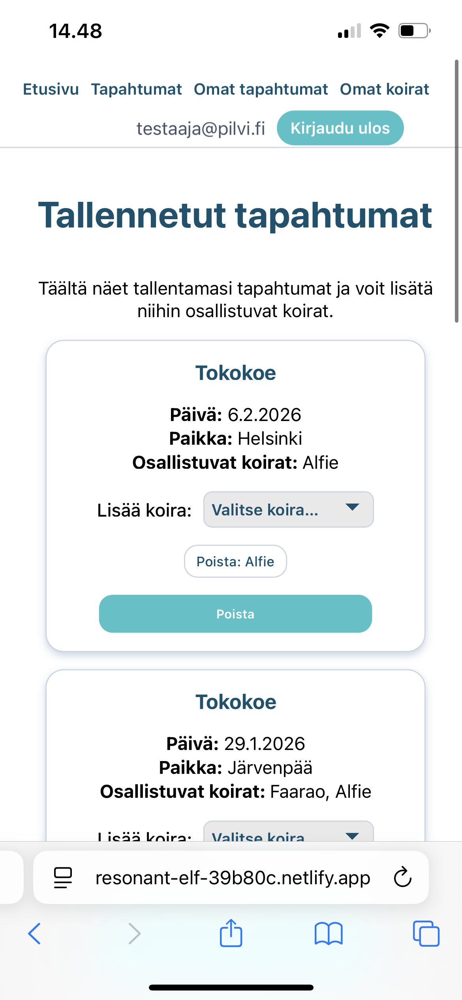
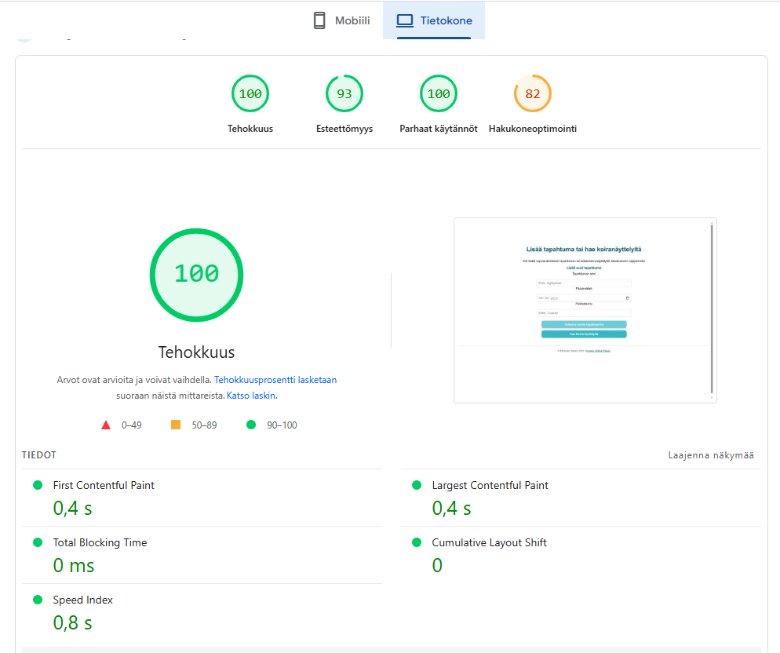
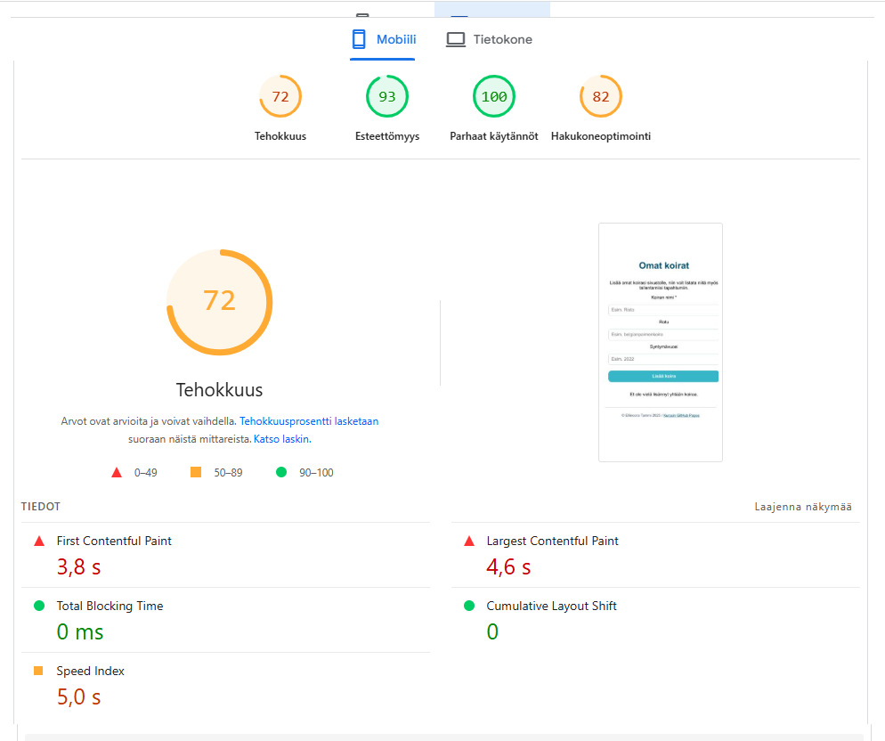

### Harjoitustyö
## Sovellus
[Linkki sovellukseen >>](https://resonant-elf-39b80c.netlify.app/)

## Harjoitustyön idea
Idea syntyi omasta koiraharrastuksesta, josta on opintojen mittaan tullut ammennettua muitakin projektiaiheita. Kohderyhmänä ovat aktiiviset koiraharrastajat, jotka haluavat jonkin selkeän ja helppokäyttöisen sivuston tulevien koiratapahtumien listaukseen.

Sivustolla käyttäjä voi etsiä koiranäyttelyitä tai lisätä vapaavalintaisia tapahtumia omalle sivulleen, ja lisätä niihin tapahtumiin osallistuvat koiransa. 

## Toiminnallisuudet
Sovelluksesta löytyy Firebase Authin sisäänkirjautumistoiminto, ja käyttäjä näkee sivuston sisällön vain kirjautuneena. Käyttäjä voi selata ja lisätä listalleen koiranäyttelyitä, jotka haetaan 3. osapuolen palvelusta (Jalostusnetti) ja jotka näkyvät sivustolla kortteina. Vaihtoehtoisesti hän voi itse lisätä listalleen minkä tahansa tapahtuman lomakkeen avulla. Tapahtumat tallentuvat Omat tapahtumat -sivulle korteiksi Firestore-tietokantaan. Lisäksi käyttäjä voi lisätä Omat koirat -sivun kautta järjestelmään omistamansa koirat, jotka hän voi lisäksi liittää tallentamiinsa tapahtumiin Omat tapahtumat -sivulla. Koiria ja tapahtumia voi lisätä ja poistaa. 

## Nielsenin heurestiikka
Sivusto on rakenteeltaan yksinkertainen ja perinteinen: navigaatiopalkki on ylälaidassa, sisältö on keskitettyä ja skaalautuvaa. Sivuston ulkoasu on yhdenmukainen ja väreissä tarpeeksi kontrastia, jotta luettavuus säilyy. Sivuston yläoikealta käyttäjä pääsee kirjautumaan ulos, ja footerin linkki vie kurssin GitHub-sivuilleni. 

Sisäänkirjautuessa sovellus ohjeistaa täyttämään sähköpostikentän sähköpostiosoitteella ja ilmoittaa, mikäli kirjautumistiedot ovat väärät. Sovellus ilmoittaa, mikäli jonkin toiminnon lataaminen (koirien, näyttelyiden tai omien tapahtumien haku) ei onnistu. Tyhjää lomaketta ei voi lähettää, ja sovellus kehottaa käyttäjää täyttämään kentät. Se myös kertoo, jos tapahtuman lisääminen onnistuu ja näyttää reaaliaikaisesti käyttäjän klikkailuilla sen, että lisätty koira ilmestyy kortiksi sivulle tai koiranäyttelykortti tallentuu. 

## Saavutettavuus
Testasin sivuston sivujen saavutettavuutta Chromen DevToolsin Lighthousella. Sekä tietokoneella että mobiilissa tulokset olivat hyviä. Esteettömyys jokaisella sivulla oli 95-100. Noottia tuli käytäntöpuolelta siitä, että sivusto käyttää kolmannen osapuolen evästeitä, ongelmia kirjautuu DevToolsiin ja JavaScript-kirjastosta puuttuu lähdekarttoja. Sivustoa ei myöskään ole hakukoneohjelmoitu sisällönkuvauksen osalta. 

## Responsiivisuus
Koetin määritellä CSS-koodiin skaalautuvuuksia eri resoluutioille, eikä grideistä tai navigaatiosta vieläkään tullut aivan täydellistä. Tietyssä leveydessä desktopilla kortit asettuvat vielä vähän päällekäin ennen ns. rivinvaihtoa pienempään määrään. Siitä kuva alla.

  

  

  

  <em>Kuva 1–2. Korttien käyttäytyminen eri selainleveyksillä.</em>

Mobiililaitteella ja kavennetulla selainikkunalla navigaatiopalkki menee kasaan siten, että käyttäjänimi ja uloskirjautumisnappi skaalautuvat rumasti navigaatiolinkkien alle. Ratkaisu tähän voisi olla avautuva ja sulkeutuva hampurilaisvalikko.

  

  

  

  <em>Kuva 3–4. Mobiili- ja kapean selainikkunan näkymät.</em>

  Testasin sivustoa kahdella eri mobiililaitteella (Apple ja Google), kannettavalla tietokoneella ja pöytäkoneella. Kaikilla laitteilla sivusto oli käytettävissä ja toiminnallisuudet toimivat moitteetta. Tietokoneiden näytöillä verkkosivusto skaalautuu selaimen ikkunan mukaisesti. 

## Testatut selaimet
Testasin sivustoa uusimmilla versioilla Chromesta, Firefoxista ja Microsoft Edgestä. Mobiilitestauksissa käytössä oli Safari sekä Chrome. Sovellus toimi kaikilla selaimilla edellä kuvatun mukaisesti.

## Latautumisaika
Latautumisaikaa testasin PageSpeed Insightsin avulla. Tietokoneversion latautuvuus oli jokaisella sivulla näillä testauksilla maksimi, mutta mobiiliversion latautumisnopeus oli toisinaan heikompi (jopa vain 72/100).

  

  

  <em>Kuva 5-6. PageSpeed Insights -rapotit tietokone- ja mobiiliversioista.</em>

## Toteuttajan kommervenkkejä
RESTinä käyttämäni Jalostusnetti ei sellaisenaan jonkin suojauksen takia toiminut suoraan sovelluksessa, vaan loin sille proxyn Cloudware.comiin.  Jalostusnetti on myös hieman mystinen päivittymisiltään, ja saattaakin olla vain jokin harrastelijaprojekti, sillä siellä on hyvin satunnaisesti tietoutta koirista, koiranäyttelyistä ja niiden oheisista. Sovellukseni listaus näyttää Jalostusnetin näyttelytietokannan rajaamattomana, eikä siellä esimerkiksi ole yhtään vuoden 2026 tulevaa näyttelyä. Listalla on satunnaisia näyttelyjä vuosi kerrallaan.

Nippeliä: Jalostusnetti-nimi viittaa Kennelliiton Jalostustietokantaan, jonne on listattu kaikki Kennelliiton alle rekisteröidyt koirat. Testailin, niin Jalostusnetti ei löytänyt esimerkiksi omia koiriani Jalostustietokannasta, vaikka se sisälsikin satunnaisesti koiria useilta eri vuosilta ja eri roduista. 

Suurin kompastuskiveni koko kurssilla oli GitHub Pagesin käyttö. En ymmärrä, miten kompuroin sinne buildaamisen kanssa joka ikisessä viikkotehtävässä. Assets-kansion siirtely sekoitti aina sovelluksen toiminnan ja rikkoi pahimmillaan toimivuuden lokaalistikin, kun yritin purkaa ja tehdä buildia uudelleen. Harjoitustyön buildaamisen kanssa luovutin kolmannen tunnin kohdalla (kyllä, miten tämä on edes mahdollista :D) ja tajusin selvittää, voiko sovelluksen ladata jonnekin muualle. Ja kappas kummaa, Netlify-palvelin buildasi GitHubiin lataamani sovelluksen toimivaksi ykkösellä. 

Käytin koodaamisen apuna tekoälyä, pääasiassa ChatGPT:tä. Se varmasti näkyy koodissa, jota en kaikkineen jaksanut siistiä mieleisekseni. Eniten väkertelyä tein css-koodin kanssa, mikä onkin itselleni mieluisinta - täydellistä ei tullut, mutta annan itselleni vähän armoa! Myös tekoälyyn nimittäin meni loppumetreillä hermot, kun Pagesiin buildaamiseen ei löytynyt mitään ratkaisua. :D Kaikkea ei sekään osannut ratkaista.